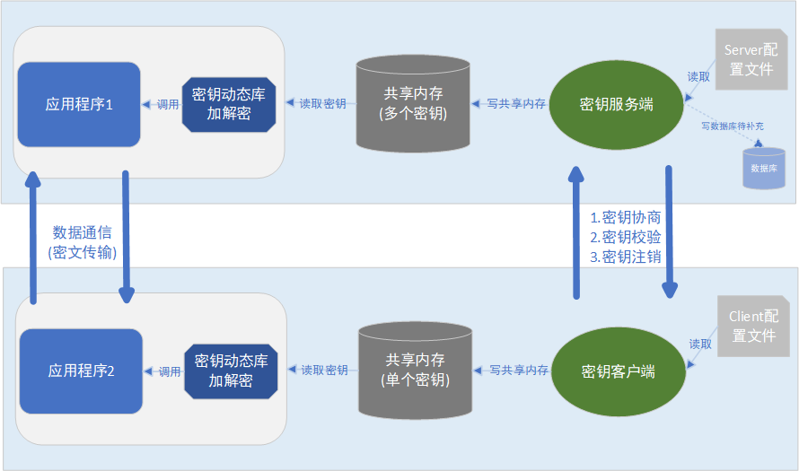
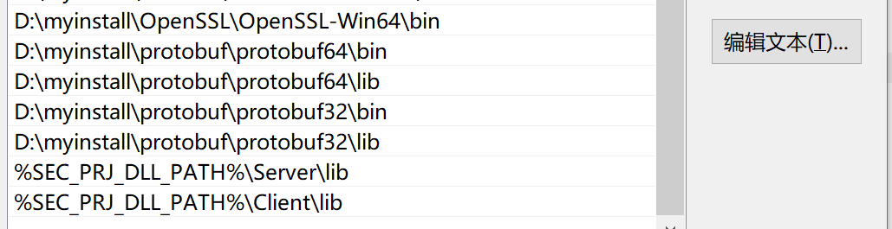
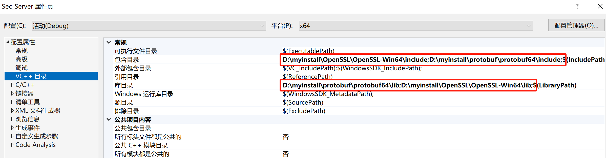
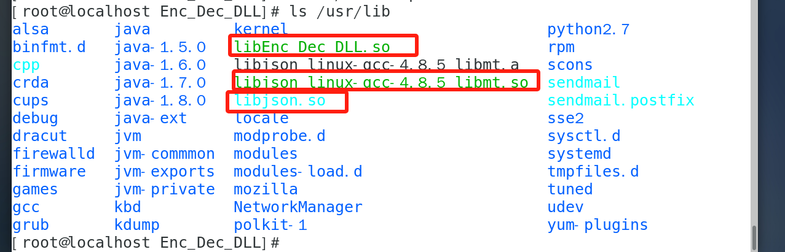
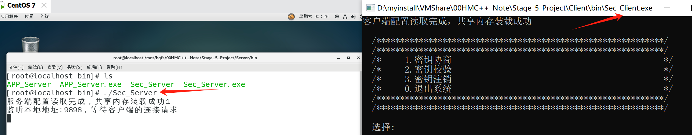
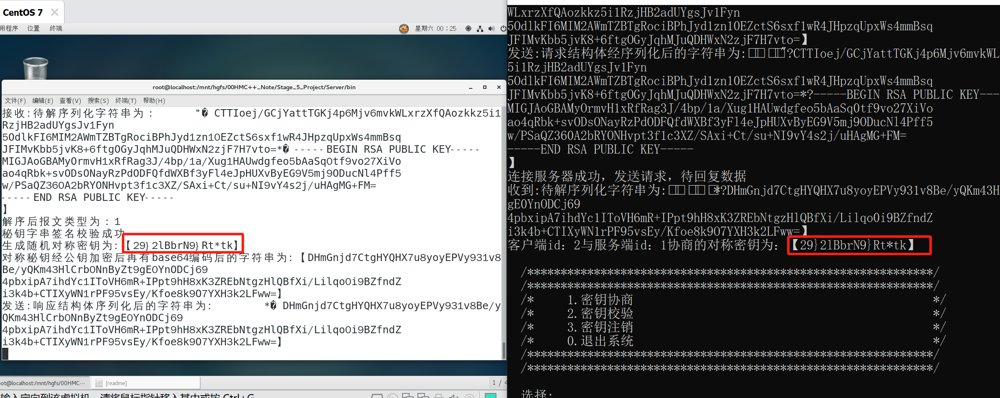
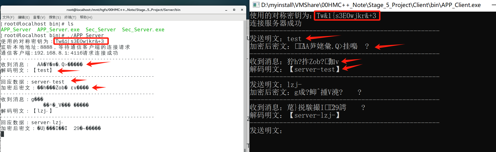

# 1. 项目简介

​	本项目是个简易的**跨平台安全通信平台**，学习使用。涉及数据的本地存储、网络传输、身份认证、数据完整性等安全问题。使用到第三方库openssl、protobuf和json。密钥相关逻辑使用到非对称密钥和堆成密钥、base64编解码、数据序列化、hash值运算等。

# 2. 项目说明

## 2.1 项目架构图



## 2.2 项目主要逻辑：

​	密钥服务端读取配置文件来监听本地ip地址端口，密钥客户端读取配置文件地址和端口来连接服务端。密钥客户端与服务端协商出的对称密钥都写入各自端共享内存，服务端可以与多个客户端协商密钥，所以共享内存可以存放多个对称密钥。

​	此时两端物理机别的业务程序可通过密钥动态库从共享内存取出对称密钥来进行加密数据通信。(写数据库待补充)

## 2.3 密钥协商主要过程：

​	客户端rsa类生成非对称密钥，将公钥作为数据，并且用私钥加密得到签名字符串(私钥加密公钥解密为签名过程，公钥很长所以先hash为短字串来加密，密文由于是二进制不易读，通过base64编码为字符串)。与服务端建立tcp连接后将携带公钥和签名的结构数据经protobuf序列化后发送至服务端，服务端逆向解序列化后先通过收到的公钥数据初始化rsa类，在通过rsa对签名的验证来确保公钥发送过程中未被篡改。

​	此时在服务端生成对称密钥，用公钥对对称密钥加密得到密钥密文(加密的二进制密文有base64编码来转成字符串)，将携带密钥的结构经序列化发送给客户端。客户端收到密钥密文，通过私钥来解密得到对称密钥，此时服务端和客户端都安全获取可使用的对称密钥。

## 2.4 目录结构：

​	Client目录为客户端机运行的所有代码文件，Server目录为服务端运行的所有文件。两目录下的目录结构相同，bin为源码编译的可执行文件，cfg为相关程序配置文件(按本机实际情况配置)，lib是win下所用的第三方或自行编译的动态库，src为各模块源码文件。src目录下的include和share文件夹为各模块程序用到的公共头文件和程序文件，公共部分包含封装的openssl类、共享内存类、封装网络通信的类以及未用到的线程池、socket池和日志类。

​	现阶段只有密钥生成模块(Sec_Servr和Sec_Client)、密钥加解密动态库(Enc_Dec_DLL)和加解密通信的demo模块(APP_Server和APP_Client)，并且是初步功能实现的验证，未全面测试。

注：lib文件夹主要放window下自行编译的动态库，第三方库装好需添加系统环境变量，linux下的库都默认放入/usr/lib下。linux下的APP_Server执行如果报./APP_Server: error while loading shared libraries: libEnc_Dec_DLL.so: cannot open shared object file: No such file or directory，那就ldconfig命令重新扫描并更新下库缓存。


## 2.5 项目部署：

​	第三方库的部署请看**Resources**目录下文件后，补充一些系统环境变量添加和库路径的修改。

#### window:

1.系统环境变量需要配库安装的位置



2.编译VS项目的话，打开有包含路径需改成实际安装路径



#### linux:

​	第三方库先按说明部署好，这里测试，分别进入Server/src/Enc_Dec_DLL中和CLient/src/Enc_Dec_DLL目录编译加解密动态库，编译好动态库包括第三方动态库都默认放入/usr/lib。

```
[root@localhost Enc_Dec_DLL]# make -f Enc_Dec_DLL.linux.mak
[root@localhost Enc_Dec_DLL]# ldconfig
```



​	如果需要重编其他模块程序，对应模块目录make -f xxx.linux.mak文件

```
如：[root@localhost Sec_Server]# make -f Sec_Server.linux.mak
```

## 2.6 demo演示：

​	这里用虚拟机linux做服务端(centos7)，物理机做客户端(win10)演示。

1.服务端启动Sec_Server和客户端启动Sec_Client协商密钥





2.密钥协商好已写入各自端共享内存，服务端启动APP_Server和客户端启动APP_Client便可通过Enc_Dec_DLL库加密通信。加密通信只是demo示例，具体可以看源码自定义编写，且程序未测试bug。



# 3. 其他补充：

## 3.1 数据的加密和解密

### 3.1.1 加密三要素

```sequence
note left of 明文: Encode
明文->密文: 加密算法+秘钥
密文-->明文: 解密算法+秘钥
note right of 密文: Decode
```

- 加密三要素:
  
  - 明文/密文
  
    - 明文 -> 原始数据
    - 密文 -> 加密之后的数据
  
  - 秘钥
  
    - 定长的字符串
    - 对称加密 ->自己生成
    - 非对称加密 -> 有对应的算法可以直接生成
  
  - 算法
  
    - 加密算法
    - 解密算法
  
  - 举例:
  
    ```c
    明文: 123
    秘钥: 111
    加密算法: 明文 + 秘钥    
    解密算法: 密文 - 秘钥
    
    加密:  123 + 111 = 密文 == 234
        
    解密: 234 - 11 = 明文 == 123
    ```
  
    

### 3.1.2 常用的加密方式

- 对称加密
  
  - 秘钥比较短
  - 秘钥只有一个
    - 加密解密使用的秘钥是相同的
  - 加密的效率高
  - 加密强度相对较低( 相对于非对称加密 )
  - 秘钥分发困难 -> 因为秘钥要保密不能泄露
    - `秘钥不能直接在网络环境中进行发送`
  
- 非对称加密
  
  - 秘钥比较长
  - 秘钥有两个, 所有的非对称加密算法都有生成密钥对的函数
    - 这两个秘钥对保存到不同的文件中, 一个文件是公钥(比较小), 一个是私钥(比较大)
    - 公钥   -> 可以公开的
    - 私钥  -> 不能公开
  - 加解密使用的秘钥不同
    - 如果使用公钥加密, `必须`私钥解密
    - 如果使用私钥加密, `必须`公钥解密
  - 效率低
  - 加密强度相对较高( 相对于对称加密 )
  - 秘钥可以直接分发 -> 分发的公钥
  
  

## 3.2 常用的加密算法

### 3.2.1 对称加密  

- <font color="red">**DES/3DES**</font>
- DES  -> 已经被破解了, 不安全
    - 秘钥长度 8byte
  - 对数据分段加密, 每组8字节
    - 得到的密文和明文长度是相同的
  - 3DES -> 3重des
    - 安全的, 效率比较低
    - 对数据分段加密, 每组8字节
    - 得到的密文和明文长度是相同的  == 8字节
    - 秘钥长度24字节, 在算法内部会被平均分成3份, == 每份8字节
      - 看成是3个秘钥
      - 每个8字节
    - 加密处理逻辑:
      - 加密: 	-> 秘钥1  * 加密算法
      - 解密     -> 秘钥2   * 解密算法
      - 加密     -> 秘钥3   * 加密算法
    - 三组秘钥都不同, 加密的等级是最高的
- <font color="red">**AES**</font>
  - 最安全, 效率最高的公开的对称加密算法
  - 秘钥长度: 16字节, 24字节, 32字节
    - 秘钥越长加密的数据越安全, 效率越低
  - `分组加密, 每组长度 16 字节`
  - 每组的密文和明文的长度相同  == 16byte
- Blowfish
- RC2/RC4/RC5
- IDEA
- SKIPJACK

### 3.2.2 非对称加密

#### 加密算法

- **RSA(数字签名和密钥交换)**
  - 项目中用的是rsa
- ECC（椭圆曲线加密算法 - 数字签名）
- Diffie-Hellman(DH, 密钥交换)
- El Gamal(数字签名)
- DSA（数字签名）

#### 秘钥交换过程

```c
// 假设通信的双方为: 客户端C, 服务器端S
// 为什么要交换?
/*
	1. 非对称加密秘钥分发方便, 但是效率低 -> 改进: 需要使用对称加密
	2. 使用对称加密 -> 秘钥分发困难 -> 改进: 使用非对称加密进行秘钥分发
		- 分发是对称加密的秘钥, 本质就是一个字符串
*/
// 秘钥交换的过程:
/*
	1. 在服务器端生成一个非对称加密的密钥对: 公钥, 私钥
	2. 服务器将公钥发送给客户端, 客户端有了公钥
	3. 在客户端生成一个随机字符串 -> 这就是对称加密需要使用的秘钥
	4. 在客户端使用公钥对生成的对称加密的秘钥进行加密 -> 密文
	5. 将加密的密文发送给服务器
	6. 服务器端使用私钥解密 -> 对称加密的秘钥
	7. 双方使用同一秘钥进行对称加密通信
*/
```

### 3.2.3 Hash算法 (单向散列函数)

> 特点: 
>
> - 不管原始数据有多长, 通过哈希算法进行计算, 得到的结果的长度是固定的
>   - 是一个二进制的字符串
> - 只要是原始数据不一样, 得到的结果就不一样
>   - 原始数据差一丢丢, 得到的结果也是完全不同的
> - 有很强的抗碰撞性
>   - 碰撞: 原始数据不同, 但是通过同样的哈希算法进行计算能得到相同的结果
>   - 推导的结论:
>    - 数据不同得到的结果就不同
>   - 应用场景:
>    - 数据校验
>     - 登录验证
>    - 秒传
> - 不可逆
>   - 得到的结果不能推导出原始数据
> 
>哈希运算的结果:
> 
>- 散列值
> - 指纹
> - 摘要

- MD4/MD5
  - 散列值长度: 16字节
  - 抗碰撞性已经被破解
- SHA-1
  - 散列值长度: 20字节
  - 抗碰撞性已经被破解
- SHA-2
  - sha224
    - 散列值长度: 224bit / 8 = 28byte
  - sha256
    - 散列值长度: 256bit / 8 = 32byte
  - sha384
    - 散列值长度: 384bit / 8 = 48byte
  - sha512
    - 散列值长度: 512bit / 8 = 64byte
- SHA3-224/SHA3-256/SHA3-384/SHA3-512


### 3.2.4 消息认证码 -> HMAC

> 作用: 
>
> - 在通信的时候, 校验通信的数据有没有被篡改(完整性)
> - 没有加密的功能
>
> 使用:
>
> - 消息认证码的本质是一个散列值
> - `(原始数据 + 秘钥) * 哈希函数 = 消息认证码`
>   - 最关键的数据: 秘钥
>
> 校验的过程:
>
> - 数据发送方A, 数据接收方B
> - 在A或B端生成一个秘钥: X, 进行分发 -> A和B端都有了 秘钥: X
> - 在A端进行散列值运算:  (原始数据 + x) * 哈希函数 = 得到散列值
> - 在A端: 将原始数据和散列值同时发送给B
> - 在B端:  -> AB端使用的哈希算法是相同的
>   - 接收数据
>   - 校验: (接收的原始数据 + x) * 哈希函数 = 散列值New
>   - 比较散列值: 散列值New 和 接收的散列值 是不是相同
>     - 相同: 没篡改
>     - 不同: 被修改了
>
> 缺点:
>
> - 秘钥分发困难
> - 不能区分消息的所有者

## 3.3 数字签名

> 作用:
>
> - 校验数据有没有被篡改(完整性)
> - 鉴别数据的所有者
> - 不能对数据加密
>
> 数字签名的过程:  -> 私钥加密数据
>
> - 生成一个非对称加密的密钥对, 分发公钥
> - 使用哈希函数对原始数据进行哈希运算 -> 散列值
> - 使用私钥对散列值加密 -> 密文
> - 将原始数据和密文一起发送给接收者
>
> 校验签名的过程:
>
> - 接收签名的一方分发的公钥
> - 接收签名者发送的数据:  `接收的原始数据 + 签名`  
> - 对数据进行判断:
>   - 对`接收的原始数据`进行哈希运算 -> 散列值new
>     - 和签名的时候使用的哈希函数相同(必须相同)
>   - 使用公钥对签名(密文) 解密 -> 得到了散列值old
>   - 比较两个散列值
>     - 相同: 数据的所有者确实是A, 并且数据没有被篡改
>     - 不同:  数据的所有者不是A或者数据被篡改了

> 

