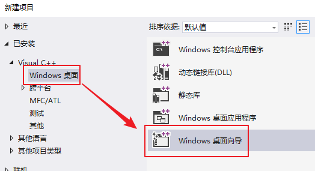
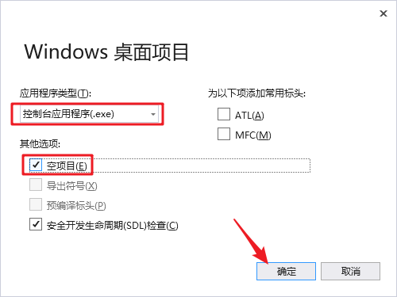

# 1. openssl的安装和使用

## 1.1 openssl介绍

> OpenSSL 是一个安全[套接字](https://baike.baidu.com/item/%E5%A5%97%E6%8E%A5%E5%AD%97)层密码库，囊括主要的[密码算法](https://baike.baidu.com/item/%E5%AF%86%E7%A0%81%E7%AE%97%E6%B3%95)、常用的[密钥](https://baike.baidu.com/item/%E5%AF%86%E9%92%A5)和证书封装管理功能及[SSL](https://baike.baidu.com/item/SSL)协议，并提供丰富的应用程序供测试或其它目的使用。 
>
> [SSL](https://baike.baidu.com/item/SSL)是Secure Sockets Layer（[安全套接层协议](https://baike.baidu.com/item/%E5%AE%89%E5%85%A8%E5%A5%97%E6%8E%A5%E5%B1%82%E5%8D%8F%E8%AE%AE)）的缩写，可以在Internet上提供秘密性传输。[Netscape](https://baike.baidu.com/item/Netscape)公司在推出第一个[Web浏览器](https://baike.baidu.com/item/Web%E6%B5%8F%E8%A7%88%E5%99%A8)的同时，提出了SSL协议标准。其目标是保证两个应用间通信的保密性和可靠性,可在服务器端和用户端同时实现支持。已经成为[Internet](https://baike.baidu.com/item/Internet)上保密通讯的工业标准。 

## 1.2 windows下安装openssl

> 下载地址: http://slproweb.com/products/Win32OpenSSL.html

选择合适的版本进行安装


以下以win32版本安装为例，安装步骤如下：


恭喜，OpenSSL安装完成。

将安装目录下的`bin`添加到系统环境变量中, 方便访问


## 1.2 Linux下安装OpenSSL

1. 下载安装包, 下载地址:  <https://www.openssl.org/source/>

2. 源码安装包解压缩

   - openssl-1.1.1c.tar.gzip 解压:

     ```shell
     $ tar zxvf openssl-1.1.1c.tar.gzip
     # 加压完成得到目录: openssl-1.1.1c
     ```

3. 进入解压目录`openssl-1.1.1c`, 安装（可参考安装文件INSTALL）:

   ```shell
   $ ./config
   $ make
   $ make test 		（可选）
   $ make install	 (使用管理员权限执行该命令)
   ```

4. 验证是否安装成功

   ```shell
   $ openssl version -a
   openssl: error while loading shared libraries: libssl.so.1.1: cannot open shared object file: No such file or directory
   # 根据之前讲的动态库知识解决动态库找不到的问题。
   先 find / -name libcrypto.so
   把系统路径复制到/etc/ld.so.conf
   之后ldconfig生效一下，权限不够加sudo
   ```
   
   > 执行命令， 正确的输出结果： 
   
   ```shell
   $ openssl version -a
   OpenSSL 1.1.1c  28 May 2019
   built on: Fri May 31 03:54:40 2019 UTC
   platform: linux-x86_64
   options:  bn(64,64) rc4(16x,int) des(int) idea(int) blowfish(ptr) 
   compiler: gcc -fPIC -pthread -m64 -Wa,--noexecstack -Wall -O3 -DOPENSSL_USE_NODELETE -DL_ENDIAN -DOPENSSL_PIC -DOPENSSL_CPUID_OBJ -DOPENSSL_IA32_SSE2 -DOPENSSL_BN_ASM_MONT -DOPENSSL_BN_ASM_MONT5 -DOPENSSL_BN_ASM_GF2m -DSHA1_ASM -DSHA256_ASM -DSHA512_ASM -DKECCAK1600_ASM -DRC4_ASM -DMD5_ASM -DAES_ASM -DVPAES_ASM -DBSAES_ASM -DGHASH_ASM -DECP_NISTZ256_ASM -DX25519_ASM -DPOLY1305_ASM -DNDEBUG
   OPENSSLDIR: "/usr/local/ssl"
   ENGINESDIR: "/usr/local/lib/engines-1.1"
   Seeding source: os-specific
   ```

## 1.2  VS中使用openssl

> 打开VS, 创建一个空的控制台应用程序





> 设置项目属性, 打开项目的属性面板


> 添加openssl头文件目录


> 选择安装目录下的 `include`目录, 里边存储了openssl的头文件


> 添加openssl的库目录


> 配置完毕


## 1.3. 测试

### 1.3.1 VS中的相关设置

> 打开项目属性窗口, 添加openssl相关的库到项目中
>
> ==**项目属性 -> 链接器 -> 输入 -> 附件依赖项**==
>
> - **libssl.lib**
> - **libcrypto.lib**


> 测试代码如下:

```c
#define _CRT_SECURE_NO_WARNINGS
#include <openssl/md5.h>		// md5 头文件
#include <stdio.h>
#include <string.h>
#include <stdlib.h>

void getMD5(const char* str, char* result)
{
	MD5_CTX ctx;
	// 初始化
	MD5_Init(&ctx);
	// 添加数据
	MD5_Update(&ctx, str, strlen(str));
	// 计算结果
	unsigned char md[16] = { 0 };
	MD5_Final(md, &ctx);
	for (int i = 0; i < 16; ++i)
	{
		sprintf(&result[i * 2], "%02x", md[i]);
	}
}

int main()
{
	char result[33] = { 0 };
	getMD5("hello, md5", result);
	printf("md5 value: %s\n", result);
	system("pause");

	return 0;
}
```

```shell
#输出结果: 
`md5 value: 33b3bc8e05b4fcc16bd531dd9adac166`
```

### 1.3.2 Linux下的使用和测试

1. 编程应用程序,  测试代码如上, 文件名为  `md5_test.c`

2. 通过gcc编译源文件

   ```shell
   # 使用的动态库: libcrypto.so
   $ gcc md5_test.c -o md5 -lcrypto
   执行该命令, 需要加载openssl的动态库
   	- libssl.so
   	- libcrypto.so
   ```


