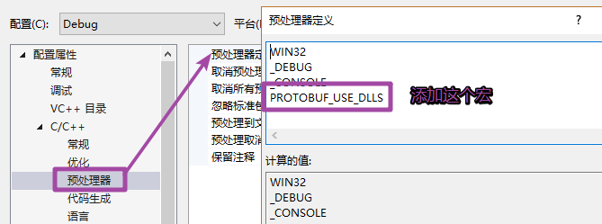

# 1. protobuf的安装

## 1.1 windows 平台 （vs2017）

- 安装protobuf

  - 下载protobuf的C++版本的源代码，地址：https://github.com/google/protobuf/releases 
    - 下载 protobuf-cpp-3.8.0.zip/tar.gz 这个包
  - 解压源码 （路径不要带中文）

- 安装cmake，下载地址：https://cmake.org/download/

- 使用cmake 生成 vs2017 工程

  

  

  > 执行完这一步之后，需要稍等一小会儿。


- 进入 vs2017 工程目录，使用vs2017打开，`F7` 编译
- 编译完成 ，在 vs2017工程目录 /Debug 目录下，可以看到生成的库文件
- 将生成的动态库和头文件放到自定义目录中备用
- 在vs中指定头文件目录和库目录(根据自己上一步实际的存储目录进行指定)
- 修改vs其他配置（这个很重要 ） 
  - 修改预处理器定义： 
    - 项目属性->c/c++ -> 预处理器 -> 预处理器定义 添加这个`PROTOBUF_USE_DLLS `宏定义 


## 1.2 在linux下的安装

参考资料: <https://github.com/protocolbuffers/protobuf/tree/master/src>

- 下载源码安装包: `protobuf-cpp-3.8.0.tar.gz`

- 解压缩

  ```shell
  $ tar zxvf protobuf-cpp-3.8.0.tar.gz
  ```

- 安装 -> 进入到解压目录

  ```shell
  $ cd protobuf-3.8.0
  $ ./configure
  $ make
  $ make check	(可选)
  $ sudo make install
  ```


# 2. 序列化

> 序列化 (Serialization)将对象的**状态信息转换为**可以**存储或传输的形式的过程**，与之相对应的过程称之为反序列化（Unserialization）。==**序列化和反序列化主要用于解决在跨平台和跨语言的情况下, 模块之间的交互和调用，但其本质是为了解决数据传输问题**==。 
>
> 实现数据序列化:
>
> - 要有原始数据
>   - 复合类型 -> 最常见的情况
>   - 基础数据类型
> - 通过某些方式 -> 另外一种形式的数据
> - 得到的数据干啥? -> 目的: 进行分发, 分发到不同的终端/平台, 保证不同的平台能正确解析
>   - 网络传输
>   - 磁盘拷贝
>
> <font color="red">序列化目的不是为了加密, 为的是数据的跨平台传输</font>
>
> 序列化的整体过程:
>
> - 发送端
>   - 原始数据 -> 序列化 (编码) -> 特殊格式的字符串
>   - 发送这个字符串
> - 接收端:
>   - 接收数据
>   - 特殊格式的字符串 -> 反序列化 (解码) -> 原始数据
>   - 对原始数据进行处理

## 2.1 网络通信中的问题分析

发送过程中遇到的一些问题?

- 平台不同
  
  - 32bit / 64bit 
    - long
  - 平台不同, 某些数据类型占用的内存大小不同
  
- 如果不是字符串, 需要进行字节序转换
  
  - 字符串没有字节序问题, 字符在内存中只占一个字节
  
  - 如果发送的是结构体
  
    ```c
    struct Test
    {
        int number;
        char buf[12];
        long sex;
    };
    
    Test t;
    send()/write()
    send(fd, (void*)t, sizeof(t), 0);
    ```
  
  - 大小端问题
  
- 语言不同
  
  - 语言不同数据类型占用的内存有可能不同
    - c -> char -> 1字节
    - java -> char -> 2字节
  
- 字节对齐问题

## 2.2 常用的序列化方式

1. XML（ Extensible Markup Language ）类似于html

   > XML是一种常用的序列化和反序列化协议，具有跨机器，跨语言等优点。XML历史悠久，其1.0版本早在1998年就形成标准，并被广泛使用至今。
   >
   > XML的最初产生目标是对互联网文档进行标记，所以它的设计理念中就包含了对于人和机器都具备可读性。 但是，当这种标记文档的设计被用来序列化对象的时候，就显得冗长而复杂。
   >
   > XML基本格式:

   ```xml
   <?xml version="1.0" encoding="utf-8"?>
   <Library>
       <Type name="小说">
           <Book author="J.K.ROWLING" price="12$">哈利波特1</Book>
           <Book author="J.K.ROWLING" price="12$">哈利波特2</Book>
           <Book author="J.K.ROWLING" price="12$">哈利波特3</Book>
           <Book author="J.K.ROWLING" price="12$">哈利波特4</Book>
       </Type>
       <Type name="历史">
           <Book author="司马迁" price="20$">史记</Book>
       </Type>
   </Library>
   ```

2. Json（ JavaScript Object Notation ）

   > JSON起源于弱类型语言Javascript，它的产生来自于一种称之为"关联数组（Associative array）"的概念，其本质是就是采用"键值对"的方式来描述对象。
   >
   > JSON格式保持了XML的人眼可读的优点，非常符合工程师对对象的理解。
   >
   > 相对于XML而言，序列化后的数据更加简洁（XML所产生序列化之后文件的大小接近JSON的两倍），而且其协议比较简单，解析速度比较快。
   >
   > JSON格式具备Javascript的先天性支持，所以被广泛应用于Web browser的应用常景中，是Ajax的事实标准协议。
   >
   > 更多资料可查看：<http://json.org/>

   ```json
   // json是一种数据格式, 不是语言, 和平台语言无关
   // json数组
   [整形, 浮点型, 布尔类型, 字符串, json数组, json对象]
   [12, 12.44, true, "hello", [1,2,3]]
   // json对象
   {
       "key":"value"
   }
   json对象中是n个键值对
   key: 必须是字符串
   value: 
   	整形
   	浮点型
   	布尔
   	字符串
   	json数组
   	json对象
   
   注意事项:
   	在一个文件中只能存储一个大的数组或者对象, 但是可以嵌套使用
   	原素和原始之间使用逗号间隔(一个键值对视为一个元素)
   	最后一个元素后边没有逗号
   
   {
       "lilei":"112334",
       "tom":"helolll",
       "lucy":"xxxxyyyy"
   }
   
   ["张三", "历史"]
   
   {
       "张三":{
           "father":"张三丰",
           "mother":"xxxx",
           "sister""xxx",
           "favorite":["足球", "乒乓", "游泳"]
       }
   	"李四":{
       }
   }
   ```

3. Protocol Buffer

4. ASN.1 抽象语法标记(Abstract Syntax Notation One) 

5. boost 序列化的类

# 3. protobuf

> Protocol Buffer( 简称 Protobuf) 是Google公司内部的混合语言数据标准，它是一种轻便高效的结构化数据存储格式，可以用于结构化数据串行化，很适合做数据存储或RPC 数据交换格式。
>
> Protobuf是一个纯粹的展示层协议，可以和各种传输层协议一起使用，Protobuf的文档也非常完善。google 提供了多种语言的实现：java、c#、c++、go 和 python，每一种实现都包含了相应语言的编译器以及库文件。
>
> Protobuf支持的数据类型相对较少，不支持常量类型。由于其设计的理念是纯粹的展现层协议，目前并没有一个专门支持Protobuf的RPC框架。
>
> 更多资料可查看：<https://developers.google.com/protocol-buffers/>

## 3.1 操作流程

> - 准备数据
>   - 复合类型: 结构体/ 类
>   - 基础类型
> - 创建一个新文件 `xxx.proto`
> - 将我们要序列化的数据 -> 写入到proto文件
>   - 有语法格式
> - 通过一个命令 `protoc`将`xxx.proto`文件生成一个c++的类 
>   - 对应一个头文件/ 源文件
>   - 操作命令-> 在window终端中: `protoc xxx.proto --cpp_out=./`
> - 直接使用这个类
>   - 里边有对数据操作的api
>     - 读数据 api
>       - 方法名字 `变量名()`
>     - 写数据 api
>       - 方法名字: `set_变量名(arg)`

```c
// 要序列化的数据
struct Persion
{
    int id;
    string name;
    string sex;	// man woman
    int age;
};

int id;
```

- 在.proto文件中定义消息格式

  ```protobuf
  // protobuf的版本
  syntax = "proto3";	// proto2
  // 组织Persion结构体
  // 语法格式
  message 关键字(相当于被创建出的类的名字)
  {
  	// 成员变量
  	数据类型 变量名 = 变量的编号;	// 编号从1开始, 不能重复
  }
  
  // .proto文件 生成 c++ 类的命令
  protoc proto文件名 --cpp_out=生成目录
  ```
  
  | .proto类型 |   **C++**类型   | **备注**                                                     |
  | :--------: | :-------------: | ------------------------------------------------------------ |
  |   double   |     double      | 64位浮点数                                                   |
  |   float    |      float      | 32位浮点数                                                   |
  |   int32    |      int32      | 32位整数                                                     |
  |   int64    |      int64      | 64位整数                                                     |
  |   uint32   |     uint32      | 32位无符号整数                                               |
  |   uint64   |     uint64      | 64位无符号整数                                               |
  |   sint32   |     sint32      | 32位整数，处理负数效率比int32更高                            |
  |   sint64   |     sint64      | 64位整数，处理负数效率比int64更高                            |
  |  fixed32   |     uint32      | 总是4个字节。如果数值总是比总是比228大的话，这个类型会比uint32高效。 |
  |  fixed64   |     uint64      | 总是8个字节。如果数值总是比总是比256大的话，这个类型会比uint64高效。 |
  |  sfixed32  |      int32      | 总是4个字节                                                  |
  |  sfixed64  |      int64      | 总是8个字节                                                  |
  |    bool    |      bool       | 布尔类型                                                     |
  |   string   |     string      | 一个字符串必须是UTF-8编码或者7-bit ASCII编码的文本           |
  |   bytes    |     string      | 处理多字节的语言字符、如中文                                 |
  |    enum    |      enum       | 枚举                                                         |
  |  message   | object of class | 自定义的消息类型                                             |
  
- repeated限定修饰符

  ```protobuf
  syntax = "proto3";
  message Persion
  {
      int32 id = 1;   // 编号从1开始
      bytes name = 2;
      string sex = 3;
      int32 age = 4;
  }
  // 要求name有多个 -> 数组
  syntax = "proto3";
  message Persion
  {
      int32 id = 1;   // 编号从1开始
      // vector<string> name;
      repeated bytes name = 2;	// name可以在程序中创建多个, 在程序中作为动态数组来使用
      string sex = 3;
      int32 age = 4;
  }
  ```

- 枚举

  ```protobuf
  syntax = "proto3";
  // 定义枚举
  enum Color
  {
  	Red = 0;	// protbuf中第一个枚举值必须为0
  	Green = 6;
  	Blue = 9;
  }
  message Persion
  {
      int32 id = 1;   // 编号从1开始
      bytes name = 2;
      string sex = 3;
      int32 age = 4;
      Color color = 5;	// 枚举变量
  }
  ```

  

- proto文件的导入

  ```protobuf
  // Persion.proto
  syntax = "proto3";
  // 导入另外一个proto文件
  import "Info.proto";
  
  enum Color
  {
  	Red = 0;	// protbuf中第一个枚举值必须为0
  	Green = 6;
  	Blue = 9;
  }
  
  message Persion
  {
      int32 id = 1;   // 编号从1开始
      repeated bytes name = 2;
      string sex = 3;
      int32 age = 4;
      Color color = 5;
      Info info = 6;	// Info对象, 导入的proto文件中的类
  }
  ```

  ```protobuf
  // Info.proto
  syntax = "proto3";
  
  message Info
  {
      bytes address = 1;  // 地址
      int32 number = 2;   // 门牌号
  }
  ```

  

- 包 -> 命名空间

  ```protobuf
  // Persion.proto
  syntax = "proto3";
  // 导入另外一个proto文件
  import "Info.proto";
  // 添加命名空间
  package itcast;	// Persion类属于itcast这个命名空间
  
  enum Color
  {
  	Red = 0;	// protbuf中第一个枚举值必须为0
  	Green = 6;
  	Blue = 9;
  }
  
  message Persion
  {
      int32 id = 1;   // 编号从1开始
      repeated bytes name = 2;
      string sex = 3;
      int32 age = 4;
      Color color = 5;
      // 命名空间.类名
      itheima.Info info = 6;	// Info对象, 导入的proto文件中的类
  }
  ```

  ```protobuf
  // Info.proto
  syntax = "proto3";
  // Persion类属于itheima这个命名空间
  package itheima;
  
  message Persion
  {
      bytes address = 1;  // 地址
      int32 number = 2;   // 门牌号
  }
  ```

  

- 使用protobuf编译器生成C++类

  ```shell
  # protobuf编译器, 编译源码得到的 protoc.exe
  # 语法
  # --cpp_out 生成的c++类的位置
  protoc.exe xxx.proto --cpp_out=目录
  ```

- 使用C++ API来读写消息

  - 读: `变量名()`
  - 写: `set_变量名(arg1, arg2, ...)`

- vs配置 -> 添加宏

  

# 4. 业务数据分析

## 4.1 客户端

```c++
// 准备要发送的数据
struct RequestMsg
{
    //1 密钥协商 //2 密钥校验; // 3 密钥注销
    int cmdType; // 报文类型
    string clientId; // 客户端编号
    string serverId; // 服务器端编号
    string sign;
    string data;
};
```

```protobuf
message RequestMsg
{
	int32 cmdType;
	bytes clientId;
}
```


## 4.2 服务器端

```c
struct RespondMsg
{
    bool rv; // 返回值
    int seckeyid; 		// 对称密钥编号 keysn
    string clientId; 	// 客户端编号
    string serverId; 	// 服务器编号
    string data; 	// 服务器端随机数
};
```

